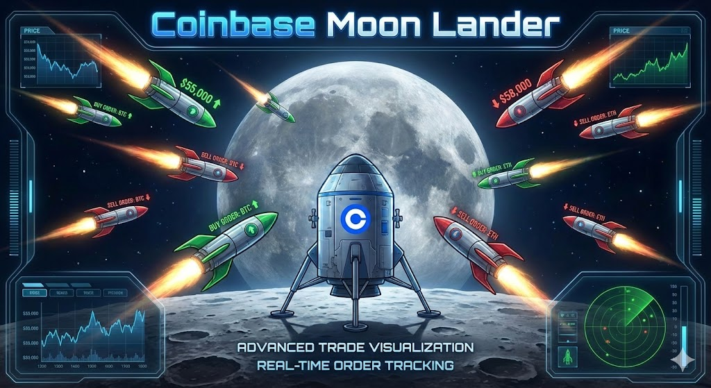

# Coinbase Moon Lander



**Visualization for your Coinbase Advanced Trade Orders.**

Turn your boring order book into a high-stakes space mission. This tool allows you to view your Coinbase buy and sell orders as an immersive visual experience. Moon Lander visually renders your active Limit and Stop orders as rockets flying through space, providing an intuitive and exciting way to track your crypto positions in real-time.

---

##  Features

###  Mission Control Center
- **Live Telemetry**: Real-time price updates fetched directly from Coinbase.
- **Visual Missions**: Every active order is a unique ship in the fleet.
- **Flight Deck**: A specialized HUD (Heads-Up Display) with animated starfields and retro sci-fi aesthetics.

###  Dynamic Flight Status
*   **STAGING (Buy Orders)**: Limit Buy orders are visualized as rockets on the launchpad, waiting for the price to drop to your entry target ("Liftoff").
*   **IN FLIGHT (Sell Orders)**: Active positions (Limit Sells or Brackets) are rockets soaring through space.
    *   **Forward Thrust**: Ships fly towards the right (Take Profit) when the price is moving in your favor.
    *   **Retreat**: Ships flip and retreat left (towards Stop Loss) if the market turns against you.

###  Health & HUD System
- **Mission Health**: A calculated 0-100% score based on the current price relative to your Stop Loss and Take Profit.
- **Color-Coded Status**:
    - **STABLE**: Cruising altitude (Blue/Cyan).
    - **UNSTABLE**: Turbulence detected (Orange).
    - **CRITICAL**: Dangerously close to Stop Loss (Red/Flashing).

---

##  Installation & Setup

### Prerequisites
- Python 3.9+
- A [Coinbase Advanced Trade](https://www.coinbase.com/advanced-trade) account.
- API Keys with `viewer` permissions (or `trade` if you plan to expand functionality).

### 1. Clone & Install
```bash
git clone https://github.com/yourusername/Coinbase-Moon-Lander.git
cd Coinbase-Moon-Lander
pip install -r requirements.txt
```

### 2. Configure Credentials

#### Option A: Local Development (.env)
Create a `.env` file in the root directory:
```bash
CB_API_KEY="your_api_key_here"
CB_API_SECRET="your_api_secret_here"
```

#### Option B: Streamlit Cloud (Secrets)
If deploying to Streamlit Cloud, add your keys to the "Secrets" management console:
```toml
CB_API_KEY = "your_api_key_here"
CB_API_SECRET = "your_api_secret_here"
```

### 3. Launch Mission Control
```bash
streamlit run coinbase-moon-lander.py
```

---

## Usage

1.  **Launch the App**: Open the local URL provided by Streamlit (usually `http://localhost:8501`).
2.  **View Your Fleet**: The dashboard will automatically scan for `OPEN` orders on your Coinbase account.
3.  **Monitor Progress**: Watch as your ships adjust their position and status based on real-time market data.

---

*Note: This tool is a visualizer. Always verify trade details on the official Coinbase platform.*
